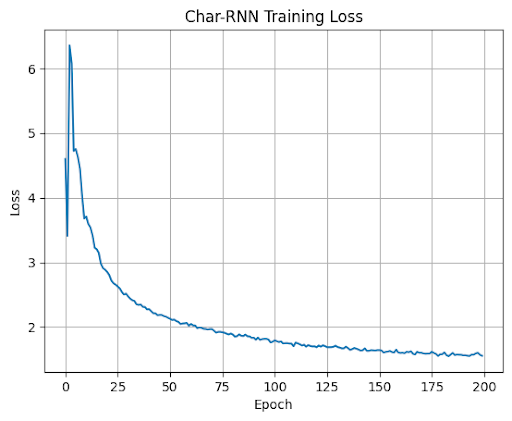

# Character-Level Text Generation with RNNs - Tiny Shakespeare Dataset

University of California, San Diego 2025

Written by: Kanishka Katragadda

Jun 13, 2025

# Abstract

Character-level text generation is a classical benchmark task in sequence modeling and natural language processing. In this project, I used a recurrent neural network (RNN) architecture to generate text in the style of Shakespeare by training on the TinyShakespeare dataset. The goal was to explore the capabilities of simple RNN models—specifically GRUs—in learning the statistical patterns of English characters and producing coherent, stylistically appropriate output. I conducted a range of experiments with architectural variations and hyperparameter tuning, using the PyTorch framework and a Tesla T4 GPU in Google Colab to accelerate training. My best model achieved a validation loss of approximately 1.47 and produced text samples that closely resembled the structure, tone, and vocabulary of Shakespearean writing.

# Introduction & Background

Sequence modeling is a key area within natural language processing (NLP), with applications in machine translation, speech recognition, and text generation. Recurrent Neural Networks (RNNs) are particularly suited to this due to their ability to maintain internal memory through sequential input, making them well-equipped to handle temporal dependencies in data.

Character-level modeling involves predicting the next character in a sequence, given the previous ones, rather than modeling entire words. This granularity allows the model to learn syntactic patterns and stylistic consistency. In this experiment, the objective was to generate new Shakespeare-like text by training an RNN on raw character input from Shakespeare's works.

Given that long-term dependencies are challenging for vanilla RNNs to capture, a Gated Recurrent Unit (GRU) was chosen to enhance information flow and mitigate vanishing gradient problems. The simplicity and interpretability of the task made it an ideal choice for exploring RNN behavior and hyperparameter optimization.

# Methodology

## Dataset

The dataset used in this project was the popular TinyShakespeare corpus, which contains roughly 1 million characters from Shakespeare's works. No preprocessing was required beyond converting characters to integer encodings for model input. The data was split into sequences of fixed length (chunk length), with overlapping segments to maximize data reuse during training.

## Model Architecture

The model follows a standard character-level GRU design, implemented using the public char-rnn.pytorch repository. The architecture consists of:

- An embedding layer to map characters into dense vectors  

- One or more GRU layers for sequence modeling  

- A linear projection layer to output logits over the character vocabulary  

The best-performing configuration used:

- **2 GRU layers**
  
- **Hidden size = 768**  
    
- **Chunk length = 200**  
    
- **Batch size = 128**  
    

Models with 3 or more layers tended to overfit or fail to converge effectively. Increasing hidden size consistently improved performance, though gains diminished beyond 768.

## Training Process

The model was trained using the Adam optimizer and cross-entropy loss, a natural choice for multi-class character prediction. Training was performed on a Google Colab environment with access to a Tesla T4 GPU. Early runs used 100–150 epochs, but the final best model was trained for **200 epochs**. Temperature-based sampling was used to explore model outputs at different creativity levels (lower = safer/more repetitive, higher = more diverse).

To evaluate training quality, the loss was printed periodically. The final model achieved a training loss of **~1.45**, down from initial values around 1.70. Lower loss correlated with improved fluency and coherence in generated text.

<p align="center">
  
  <br/>
  <em>Figure 1: CharRNN Training Loss</em>
</p>

# Results and Discussion

## Model Performance

Performance was measured qualitatively (sample outputs) and quantitatively (loss minimization). Here are some observations:

- **t = 0.4** (low temperature): Produced grammatically clean but repetitive lines. Safe, structured output.
```
ROMEO: I will and me not the common to the seems him to the death And the crown to see to your the consent.

QUEEN ELIZABETH: The love of the marry to the poor more the will not the married and here That more the better married the power to the them a may prove to the tears, Who will the come in the country death of the duke me to the counsels, When I come to the married my proud so most some of the come the consent.

KING RICHARD II: Why, in the same of this is the consent?
```

- **t = 0.6**: Balanced coherence and diversity; good creative outputs while maintaining structure.  
```
ROMEO: But he a king it man the wast done.

KING HENRY VI: The back to the come on her brother, that the may shall be trusty That me the labour to the marry, And to dear than power to the comed to see his house of this consent.

TRANIO: A cracted but under that not thou art That he dooth how not prince to the trought To make me love on the place, mine of the war.

KING RICHARD III: We the remember to the countenance, and so blood. PROSPERO: What, where I must of your brother, I can so be a come of thine.

HORTENSIO: What, and which I say the come, Provost the comes.

Second Servant: The sun shreed; I would the prove we mark the sapt your commends with the day To man your brother, more metter to him as the country, Cannot the trust thou that a dr
```
- **t = 0.8**: Generated more unexpected and creative phrases, but increased noise and nonsensical lines.  
```
ROMEO: But not as, not I was mering; But sinselly man, but.

TRANA: What, nor his corrence!

HORTENSIO: The respecter the king of my list away?

POMPEY: That I will there me he breather from here more her longer, Prow not be consconscury lay The ben curst this more other, sell mother; I mine of the word thy great three comes own; Of there was him to dine commends The carely in thrive on wide; I said I do young your shall be gods about your consul, And I come not own other, mistress; and king being like.

KING RICHARD III: What most twells as me stand not speak?

CORIOLANUS: Thine have, see'll couth, my lord, go, and more not. PAULINA: My lords him, now shall soul to; And more thore fontragues.

BROMEO: We me, how more lights, that is this lozes.
```
Overall, temperature **0.6** offered the best balance of stylistic imitation and creativity. Loss reduction plateaued around **1.45–1.5**, with diminishing returns from additional epochs or architectural changes.

#### **Generalization to Other Texts: Sherlock Holmes**

To evaluate the model’s generalizability beyond Shakespeare, the same architecture was retrained on a corpus of Sherlock Holmes stories. While the underlying approaches were unchanged, stylistic differences in the corpus resulted in different model behavior.

Sample outputs at varying temperature levels:

**t = 0.4:**  
```
Holmes: "'And why I am so you have a small brown and have a small your hands of the house of the matter of the floor of the stairs, and the looking conting his hand and from the goose of the stood to see that an indicted of the attending of the morning the first of the colonel and lifelled and the corridor of the streets, and there was a passing the story of the corrided and morning that I have been heard and the door in the possible singular and should be some considerable should some to me that the matter, and I have been remained to the streets of the long from the seemed to the streets to me the matter, and I was something out of a very closely and complete bridge which I have a man and considerable and having and stepped to my for the compli
```
**t = 0.6:**  
```
Holmes: All that Boness that you as shown as the dear the home should some possibly disguesty door was the commoonel in a spinced to his geen him and in a small of a steps had some advice by this the door and day and man on the grown to the arts and dress to me that it is in the window what on the jeweller some from the threather was a complice to discration of the true sithing of a particulation which I could not just be to the most a little things of a books of the corones round his some for me, the strong little best and made a villows of my reather some home. But I letters, and I come and most of at my should not that I could be every much of the exadudred the clanched and thing to me the horrow more to him and little door. On the all the bac  
```
**t = 0.8:**  
```
Holmes: All some in the anto a very from the maided of the clergarthy ancent in able countral probsoner." "Precting gems in my right cooseen and at from the side of reason end your slipse. He was arry, and a suright sust leave, the soment the dember mestraing this bortunation. There was my business, and its want them?" "No once is some aother life." "But have seems the difbilian?" "It opient a passessed agent of in London her sometillicing in my sprise to unto the glanced."
```
# Conclusion

This experiment demonstrated the ability of a moderately deep GRU-based RNN to learn the patterns and structure of Shakespearean text at the character level. By tuning hidden size, batch size, and sequence length, the model was able to achieve a loss of **1.47**, generating surprisingly coherent passages. The use of temperature in sampling highlighted the trade-offs between creativity and grammatical correctness.

Further improvements could involve:

- Switching to an LSTM or Transformer architecture  

- Using a larger corpus or more varied literary datasets  

- Training on word-level instead of character-level tokens  

This project provided a strong foundation in sequence modeling and generative text architectures, validating the power of even relatively simple RNNs in NLP.

# References

**Dataset:**

- TinyShakespeare Corpus. Available at: <https://raw.githubusercontent.com/karpathy/char-rnn/master/data/tinyshakespeare/input.txt>
- Arthur Conan Doyle's _Sherlock Holmes_ stories. Public domain text via Project Gutenberg: <https://www.gutenberg.org/ebooks/1661>  

**Implementation:**

- char-rnn.pytorch (2017). GitHub repository by Shawn Presser. Available at: <https://github.com/spro/char-rnn.pytorch>

**Key Papers:**

- Karpathy, A. (2015). _The Unreasonable Effectiveness of Recurrent Neural Networks_. Blog post. <https://karpathy.github.io/2015/05/21/rnn-effectiveness/>
- Cho, K., van Merriënboer, B., Gulcehre, C., Bahdanau, D., Bougares, F., Schwenk, H., & Bengio, Y. (2014). _Learning Phrase Representations using RNN Encoder–Decoder for Statistical Machine Translation_. arXiv preprint arXiv:1406.1078.  

- Chung, J., Gulcehre, C., Cho, K., & Bengio, Y. (2014). _Empirical Evaluation of Gated Recurrent Neural Networks on Sequence Modeling_. arXiv preprint arXiv:1412.3555.
